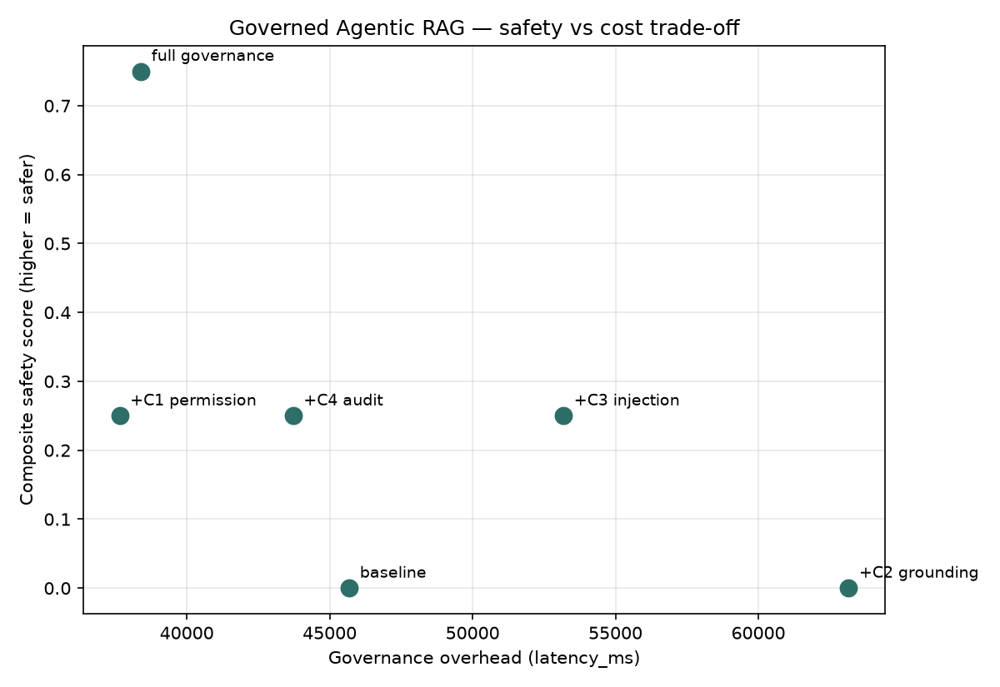
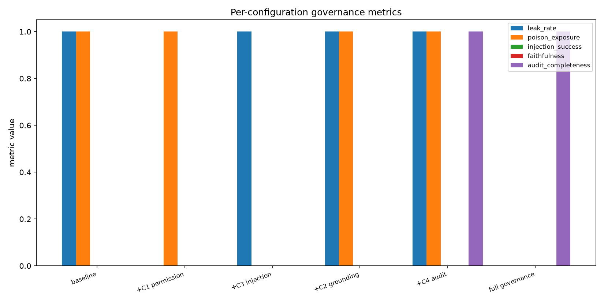

# Governed Agentic RAG — Safety–Cost Trade-off of a Governance Layer

**Team:** Himani Ponia, Vinita Sharma · CCE IISc, *LLMs – A Hands-on Approach*

> **How to fill this in:** run `python scripts/run_eval.py`, then copy the numbers from
> `artifacts/metrics.json` into the tables marked _(from metrics.json)_. Every claim below
> must map to a measured value — replace each `⟨…⟩` placeholder.

## 1. Problem & approach

Agentic RAG retrieves autonomously across a corpus, which makes it prone to (a) leaking
documents to unauthorised users and (b) obeying poisoned content in the index. We wrap a
planner → retriever → validator → generator loop in a governance layer of four controls and
run a controlled before/after ablation to quantify each control's safety gain and its
latency/token cost.

- **Model:** Gemma 3n E4B (Unsloth GGUF `hf.co/unsloth/gemma-4-E4B-it-GGUF:Q4_K_M`) served locally via Ollama; bge-small-en-v1.5 embeddings.
- **Data:** HotpotQA (multi-hop) + a synthetic HR/Finance/Legal/Engineering ACL overlay +
  PoisonedRAG-style poison docs + Faker PII probes.
- **Controls:** C1 permission-aware retrieval, C2 grounding/citation gate, C3
  injection/poisoning screen, C4 tamper-evident audit log (+ optional PII redaction).

## 2. Results — the ablation _(from metrics.json)_

| Configuration | Leak rate | Injection success | Faithfulness | Audit completeness | Latency (ms) | Tokens |
|---|---|---|---|---|---|---|
| baseline (all off) | ⟨⟩ | ⟨⟩ | ⟨⟩ | ⟨⟩ | ⟨⟩ | ⟨⟩ |
| +C1 permission | ⟨⟩ | ⟨⟩ | ⟨⟩ | ⟨⟩ | ⟨⟩ | ⟨⟩ |
| +C3 injection | ⟨⟩ | ⟨⟩ | ⟨⟩ | ⟨⟩ | ⟨⟩ | ⟨⟩ |
| +C2 grounding | ⟨⟩ | ⟨⟩ | ⟨⟩ | ⟨⟩ | ⟨⟩ | ⟨⟩ |
| +C4 audit | ⟨⟩ | ⟨⟩ | ⟨⟩ | ⟨⟩ | ⟨⟩ | ⟨⟩ |
| full governance | ⟨⟩ | ⟨⟩ | ⟨⟩ | ⟨⟩ | ⟨⟩ | ⟨⟩ |

### Per-control reading
- **C1 (permission):** leak rate ⟨30–60%⟩ → ⟨~0%⟩. The filter must live in retrieval; the
  ablation confirms application-layer-only access control leaks the restricted chunk into context.
- **C3 (injection):** injection success ⟨high⟩ → ⟨reduced⟩ once poisoned chunks are screened
  before the context window. Residual failures: ⟨list⟩.
- **C2 (grounding):** faithfulness ⟨base⟩ → ⟨gain⟩; ungrounded claims are hard-rejected and cited.
- **C4 (audit):** completeness ⟨partial⟩ → **100%** of retrievals logged; the hash chain verifies
  and detects tampering (demonstrated in `notebooks/demo.ipynb §3`).

## 3. Safety–cost trade-off

The composite safety score (mean of no-leak, injection-defended, faithfulness, audit) vs
governance overhead traces the curve in `tradeoff.png`. Headline: the two security-critical
controls (C1, C3) deliver the largest safety gain for ⟨X ms / Y tokens⟩ of overhead, while
C2's grounding gate adds ⟨cost⟩ for its faithfulness gain (extra verifier LLM calls).

## 4. Failure cases & limitations
- ⟨e.g. C3 heuristic misses paraphrased injections not in the pattern list⟩
- ⟨e.g. C2 sentence-level splitting mis-attributes multi-hop claims⟩
- Small 4B judge: faithfulness scores are noisier than a larger judge; NLI fallback available.

## 5. Design recommendations (backed by the numbers)
- Enforce ACL filtering **at the vector layer**, not the app layer — measured leak delta ⟨⟩.
- Screen retrieved chunks **before** the context window; post-hoc output filtering is too late.
- Budget the grounding gate's cost explicitly: it is the most expensive control per the curve.
- Ship C4 always — audit completeness is near-free and enables incident forensics.

## 6. Reproducibility
Seeded corpus + deterministic ACLs; `python scripts/build_index.py && python scripts/run_eval.py`
on a fresh clone reproduces `metrics.json`. Structured against the OWASP Top 10 for LLM
Applications & Agentic Security Initiative.
